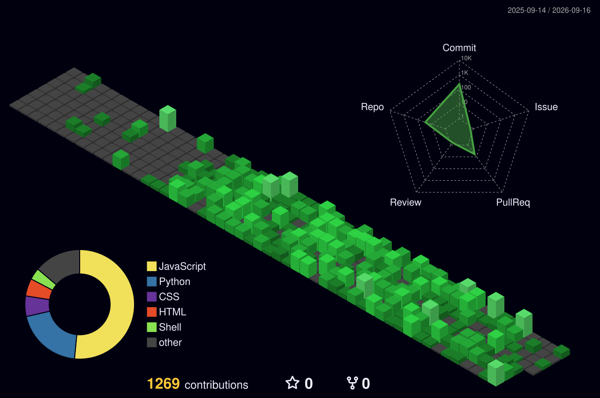

  

## 🪐 Tech Stack

 

### 💻 Languages

  

### 📊 Data & Python Tools

  

### 🎨 Web & Frontend

  

### 🛠️ Tools & Platforms

  

 

  

### 🧠 Concepts & Interests

 

 

<table align="center">
<tr>
<td width="50%" valign="top">

**📊 Stats**

</td>
<td width="50%" valign="top">

**🔥 Streak**

</td>
</tr>
</table>

**✨ Activity**

  

**🧊 Isometric Contributions**

**📬 Reach Me**

  

 

 

